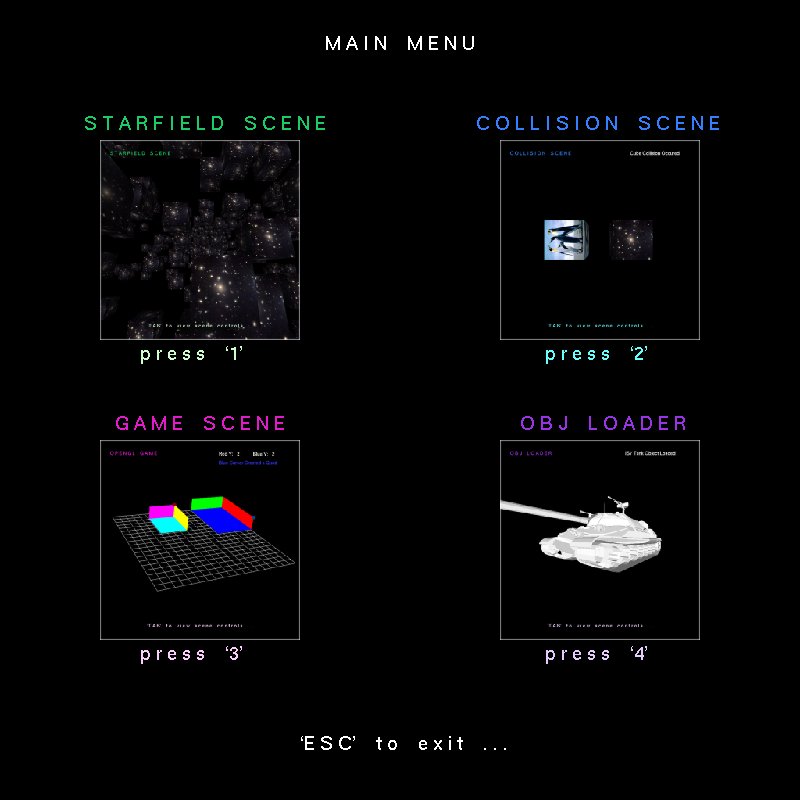

# OpenGL Cubes

&nbsp;

&nbsp;

A simple graphical application created using OpenGL as part of my 2nd semester FOGGS module.

*- Click <a href="https://kyle-robinson.github.io/html/opengl-cubes" target="_blank">here</a> for more information on website -* 

## Features

- [x] Texturing
- [x] Lighting
- [x] Binary Trees
- [x] Scene Graphs
- [x] Scene Manager
- [x] User Interface
- [x] Collision Detection
- [x] Model Loading
- [x] Scene Manipulation

---

### Credits

        Source Code:
                    https://learnopengl.com/
                    https://www.youtube.com/watch?v=wVhSQHKvBW4
